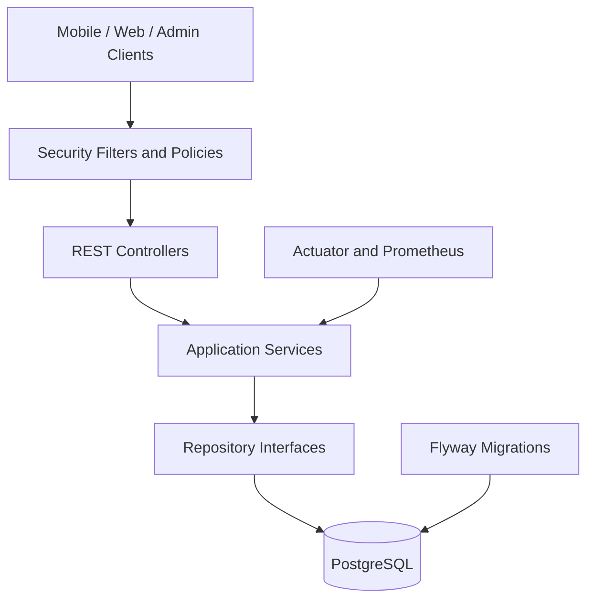
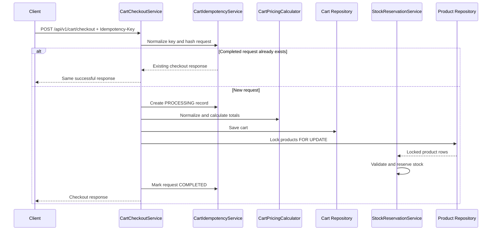
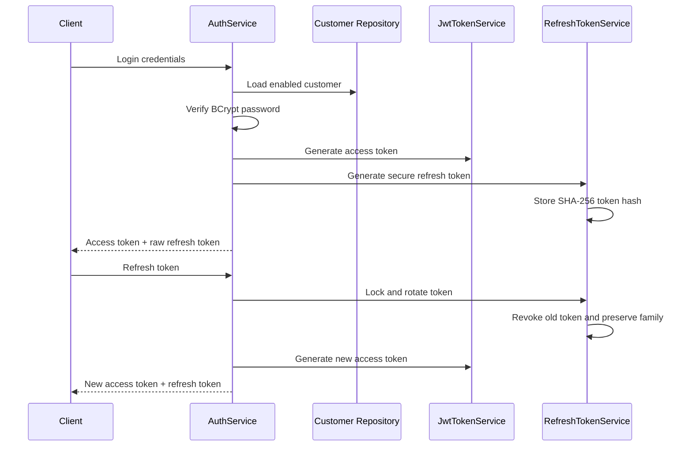

<div align="center">

# Shop Market Backend

### Production-oriented e-commerce API built with Kotlin and Spring Boot

A modular monolith backend for product catalogs, customer accounts, shopping carts,  
secure authentication, stock reservation, administration and operational monitoring.

[](https://github.com/ALISCHILLER/Shop-Market-backend/actions/workflows/ci.yml)
[](https://kotlinlang.org/)
[](https://spring.io/projects/spring-boot)
[](https://openjdk.org/)
[](https://www.postgresql.org/)
[](https://www.docker.com/)
[](#license)

[Features](#features) •
[Architecture](#architecture) •
[Getting Started](#getting-started) •
[API](#api-overview) •
[Security](#security) •
[Production](#production-configuration) •
[Testing](#testing-and-quality-gates)

</div>

---

## Overview

**Shop Market Backend** is a production-oriented REST API for the Shop Market ecosystem.

It supports mobile and web clients, public catalog browsing, customer authentication, cart simulation and checkout, stock reservation, administrative management and operational monitoring.

The codebase is implemented as a **layered modular monolith**. This keeps deployment and data consistency straightforward while preserving clear boundaries that can later support extracting domains such as Catalog, Customer, Cart or Administration into independent services.

```text
Root package: com.msa.eshop.backend
Application version: 2.0.0
Default local port: 8282
```

---

## Features

### Authentication and account security

- Stateless JWT Bearer authentication
- HS256 access tokens
- Refresh-token rotation
- SHA-256 hashed refresh tokens in the database
- Refresh-token family tracking
- Refresh-token reuse detection
- Revocation of an entire token family after reuse
- BCrypt password hashing with strength `12`
- Password-policy validation
- Token invalidation after password changes
- Disabled-account rejection
- Role consistency validation
- Authentication endpoint rate limiting
- Strict production startup validation

### Catalog

- Public paginated product catalog
- Product search and filtering
- Product details
- Product categories
- Product discounts
- Promotional banners
- Configurable sorting and pagination
- Clean public REST endpoints

### Cart and checkout

- Customer-address lookup
- Payment-term lookup
- Cart price simulation
- Product and payment discounts
- Tax calculation
- Typed payment kinds
- Cart checkout
- Idempotent checkout requests
- Canonical request hashing
- Duplicate checkout response recovery
- Request/key mismatch rejection
- Customer ownership validation
- Cart history and details

### Stock management

- Product stock validation
- Pessimistic database locking during reservation
- Atomic stock reservation during checkout
- Active reservation records
- Reservation release
- Reservation consumption
- Overselling protection inside the checkout transaction

### Administration

- Product management
- Customer management
- Address management
- Discount management
- Banner management
- Payment-term management
- Product-group management
- Cart search and status updates
- Administrative dashboard
- Audit-log access
- Role-based `ADMIN` authorization
- Pagination for heavy administrative queries

### Operations and observability

- Spring Boot Actuator
- Liveness and readiness probes
- Health, metrics and info endpoints
- Prometheus registry
- Graceful shutdown
- Response compression
- HikariCP tuning
- UTC database time configuration
- Structured ECS logging in production
- Swagger and OpenAPI in development
- Swagger disabled by default in production

### Delivery and quality

- Flyway database migrations
- Separate common and development migrations
- Docker multi-stage build
- Non-root runtime container
- Docker Compose development environment
- Container health checks
- Gradle Wrapper
- Testcontainers integration tests
- OWASP dependency vulnerability scanning
- CI test, scan, JAR and Docker-image build

---

## Tech Stack

| Area | Technology |
|---|---|
| Language | Kotlin `2.3.21` |
| Framework | Spring Boot `3.5.14` |
| Java | JDK `21` |
| Web | Spring Web MVC |
| Security | Spring Security, JWT, BCrypt |
| Persistence | Spring Data JPA, Hibernate |
| Database | PostgreSQL |
| Migrations | Flyway |
| Validation | Jakarta Bean Validation |
| API documentation | springdoc OpenAPI `2.8.17` |
| Observability | Actuator, Micrometer, Prometheus |
| Testing | JUnit 5, Spring Security Test, Testcontainers |
| Security scanning | OWASP Dependency-Check `12.2.2` |
| Build | Gradle Kotlin DSL |
| Delivery | Docker, Docker Compose, GitHub Actions |

---

## Architecture

The application follows a layered modular-monolith structure:



### Package structure

```text
src/main/kotlin/com/msa/eshop/backend
├── EshopApplication.kt
├── api/          # HTTP controllers and API contracts
├── service/      # Use cases, business rules and transactions
├── domain/       # JPA entities and repositories
├── common/       # DTOs, exceptions, response envelopes and utilities
├── security/     # JWT, filters, authentication and authorization
└── config/       # Spring, Jackson, OpenAPI and startup configuration
```

### Layer rules

- Controllers manage HTTP contracts and initial validation.
- Controllers do not call repositories directly.
- Business rules and transaction boundaries belong in services.
- Repositories own database access.
- JPA entities are persistence models.
- DTOs remain separate from entities.
- Security and configuration remain outside domain logic.
- Every database change requires a Flyway migration.
- Heavy query endpoints use pagination.

See [docs/ARCHITECTURE.md](docs/ARCHITECTURE.md) for the full architecture guide.

---

## Checkout Flow

Checkout is transactional and supports optional idempotency.



### Idempotency behavior

Clients may send:

```http
Idempotency-Key: <unique-key>
```

For the same customer and checkout endpoint:

- Reusing the same key with the same canonical request returns the existing completed checkout.
- Reusing the same key with different request data is rejected.
- A request already being processed is rejected rather than executed twice.
- Checkout identity is based on a SHA-256 hash of normalized request data.

---

## Authentication Flow



A reused replaced refresh token marks the token as reused and revokes active tokens in the same family.

---

## API Response Envelope

All application responses use a common envelope:

```json
{
  "data": {},
  "hasError": false,
  "message": null
}
```

Error responses follow the same contract with `hasError: true`.

---

## API Overview

### Authentication

| Method | Endpoint | Authentication |
|---|---|---|
| `POST` | `/api/v1/auth/login` | Public |
| `POST` | `/api/v1/auth/refresh` | Public |
| `POST` | `/api/v1/auth/logout` | Public |
| `POST` | `/api/v1/auth/change-password` | Bearer token |
| `GET` | `/api/v1/auth/me` | Bearer token |

### Public catalog

| Method | Endpoint |
|---|---|
| `GET` | `/api/v1/products` |
| `GET` | `/api/v1/products/{id}` |
| `GET` | `/api/v1/products/{id}/discounts` |
| `GET` | `/api/v1/product-categories` |
| `GET` | `/api/v1/banners` |

### Customer cart

All cart endpoints require a valid customer JWT.

| Method | Endpoint |
|---|---|
| `GET` | `/api/v1/cart/addresses` |
| `GET` | `/api/v1/cart/payment-terms` |
| `POST` | `/api/v1/cart/simulate` |
| `POST` | `/api/v1/cart/checkout` |
| `GET` | `/api/v1/cart/history` |
| `GET` | `/api/v1/cart/{cartCode}` |

### Administration

All `/api/v1/admin/**` endpoints require the `ADMIN` role.

Administrative resources include:

- Products
- Customers
- Addresses
- Discounts
- Carts
- Banners
- Payment terms
- Product groups
- Dashboard
- Audit logs

The complete endpoint contract and example payloads are available in:

- [API endpoint documentation](docs/API_ENDPOINTS.md)
- [Postman collection](docs/postman_collection.json)

---

## Getting Started

### Requirements

- JDK `21`
- Git
- PostgreSQL, or Docker with Docker Compose
- Bash for the included smoke-test script
- Internet access for the first dependency resolution

The Gradle Wrapper is included. A separate Gradle installation is not required.

### Clone

```bash
git clone https://github.com/ALISCHILLER/Shop-Market-backend.git
cd Shop-Market-backend
```

---

## Run with Docker Compose

This is the fastest complete local setup.

Create a local environment file:

```bash
cp .env.docker.example .env
```

Before starting, replace the example JWT secret in `.env` with a local development value.

Start PostgreSQL and the API:

```bash
docker compose up --build
```

Run in the background:

```bash
docker compose up -d --build
```

Stop the stack:

```bash
docker compose down
```

Stop and remove local database data:

```bash
docker compose down -v
```

Default local URLs:

```text
API:        http://localhost:8282
Swagger UI: http://localhost:8282/swagger-ui.html
OpenAPI:    http://localhost:8282/v3/api-docs
Health:     http://localhost:8282/actuator/health
Readiness:  http://localhost:8282/actuator/health/readiness
Liveness:   http://localhost:8282/actuator/health/liveness
```

---

## Run without Docker

### Create the local PostgreSQL database

Open `psql` as an administrative user:

```sql
CREATE USER eshop WITH PASSWORD 'replace-with-a-local-password';
CREATE DATABASE eshop OWNER eshop;

\c eshop

GRANT ALL ON SCHEMA public TO eshop;
GRANT ALL PRIVILEGES ON DATABASE eshop TO eshop;
```

### Configure environment variables

Linux/macOS:

```bash
export SPRING_PROFILES_ACTIVE=dev
export SPRING_DOCKER_COMPOSE_ENABLED=false

export DB_URL=jdbc:postgresql://localhost:5432/eshop
export DB_USERNAME=eshop
export DB_PASSWORD=replace-with-a-local-password

export ESHOP_JWT_SECRET=replace-with-a-long-local-development-secret
export ESHOP_JWT_EXPIRATION_MINUTES=1440
export ESHOP_REFRESH_TOKEN_EXPIRATION_DAYS=30

export CORS_ALLOWED_ORIGINS='*'
export ESHOP_TRUST_FORWARDED_HEADERS=false
```

Windows PowerShell:

```powershell
$env:SPRING_PROFILES_ACTIVE="dev"
$env:SPRING_DOCKER_COMPOSE_ENABLED="false"

$env:DB_URL="jdbc:postgresql://localhost:5432/eshop"
$env:DB_USERNAME="eshop"
$env:DB_PASSWORD="replace-with-a-local-password"

$env:ESHOP_JWT_SECRET="replace-with-a-long-local-development-secret"
$env:ESHOP_JWT_EXPIRATION_MINUTES="1440"
$env:ESHOP_REFRESH_TOKEN_EXPIRATION_DAYS="30"

$env:CORS_ALLOWED_ORIGINS="*"
$env:ESHOP_TRUST_FORWARDED_HEADERS="false"
```

Run:

```bash
./gradlew bootRun
```

On Windows:

```powershell
.\gradlew.bat bootRun
```

---

## Development Seed Accounts

The `dev` Flyway profile creates local-only sample accounts.

<details>
<summary>Show development credentials</summary>

```text
Customer
customerCode: 1001
password:     123456

Administrator
customerCode: admin
password:     admin123
```

These credentials are for local development only. The development seed migration is not loaded by the production profile.

</details>

Do not copy these values into staging or production environments.

---

## Android Client Connection

Android Emulator:

```kotlin
private const val BASE_URL = "http://10.0.2.2:8282/"
```

Physical Android device on the same development network:

```kotlin
private const val BASE_URL = "http://192.168.x.x:8282/"
```

Production clients must use HTTPS.

---

## Database Migrations

Flyway owns the database schema.

```text
src/main/resources/db/migration
├── common/
│   └── V1__schema.sql
└── dev/
    └── V100__dev_seed_data.sql
```

Profile behavior:

| Profile | Migration locations |
|---|---|
| `dev` | `common` + `dev` |
| `prod` | `common` only |

Hibernate uses:

```text
ddl-auto: validate
```

Application startup fails if the entity model does not match the migrated schema.

### Migration rules

- Never edit an applied production migration.
- Add a new versioned migration for every schema change.
- Keep development seed data outside common migrations.
- Review Flyway checksums before deployment.
- Back up production data before destructive migrations.

---

## Security

### Implemented protections

- Stateless Spring Security configuration
- BCrypt password hashing with cost `12`
- Constant-time JWT signature comparison
- Token expiry validation
- User status and role validation on authenticated requests
- Refresh-token hashing
- Refresh-token rotation
- Refresh-token reuse detection
- Refresh-token family revocation
- Password-policy checks
- Password-change token invalidation
- Authentication rate limits
- Role-based administrative routes
- Explicit CORS configuration
- Strict production startup validation
- No Open Session in View
- Production error-detail suppression
- Disabled production Swagger/OpenAPI
- Dependency vulnerability scanning
- Non-root Docker runtime user

### Public routes

Public access is limited to:

- Login, refresh and logout
- Public catalog reads
- Product categories and banners
- Health probes
- Development Swagger/OpenAPI when enabled

All other routes require authentication, and administrative routes require `ADMIN`.

### Important limitations

The current authentication rate limiter is in-memory. It is suitable for a single API instance but is not globally consistent across multiple replicas.

For multi-instance deployment, replace or complement it with:

- Redis-backed rate limiting
- API-gateway rate limiting
- Reverse-proxy rate limiting
- Central abuse detection

The access-token implementation is intentionally small and uses HS256. Keep its parser and signing behavior under focused security tests, rotate secrets through deployment tooling and consider a mature JOSE library when broader JWT features or key rotation are required.

---

## Production Configuration

Always activate the production profile explicitly:

```bash
SPRING_PROFILES_ACTIVE=prod
```

### Required production values

| Variable | Requirement |
|---|---|
| `DB_URL` | Production PostgreSQL JDBC URL |
| `DB_USERNAME` | Least-privilege database user |
| `DB_PASSWORD` | Secret-store managed password |
| `ESHOP_JWT_SECRET` | Random secret of at least 64 characters |
| `ESHOP_JWT_EXPIRATION_MINUTES` | Positive value, maximum `120` outside relaxed profiles |
| `ESHOP_REFRESH_TOKEN_EXPIRATION_DAYS` | Positive value, maximum `90` outside relaxed profiles |
| `CORS_ALLOWED_ORIGINS` | Explicit trusted origins; wildcard is rejected |
| `ESHOP_TRUST_FORWARDED_HEADERS` | Enable only behind a trusted proxy |
| `SERVER_FORWARD_HEADERS_STRATEGY` | Configure for the deployment proxy model |

### Optional tuning

| Variable | Default purpose |
|---|---|
| `SERVER_PORT` | HTTP port |
| `DB_POOL_MAX_SIZE` | Hikari maximum pool size |
| `DB_POOL_MIN_IDLE` | Hikari minimum idle connections |
| `DB_CONNECTION_TIMEOUT_MS` | Connection timeout |
| `DB_VALIDATION_TIMEOUT_MS` | Validation timeout |
| `DB_IDLE_TIMEOUT_MS` | Idle timeout |
| `DB_MAX_LIFETIME_MS` | Connection maximum lifetime |
| `DB_LEAK_DETECTION_THRESHOLD_MS` | Optional connection-leak detection |
| `ESHOP_TAX_PERCENT` | Invoice tax percentage |
| `APP_LOG_LEVEL` | Application package log level |
| `ROOT_LOG_LEVEL` | Root production log level |

### Production fail-fast checks

Outside `dev`, `test` and `local`, startup rejects:

- Blank or placeholder JWT secrets
- JWT secrets shorter than 64 characters
- Access-token lifetimes above 120 minutes
- Refresh-token lifetimes above 90 days
- Empty or wildcard CORS origins
- Forwarded-header trust outside an approved proxy profile

---

## Docker Image

Build locally:

```bash
docker build -t shop-market-backend:local .
```

The image uses:

- A JDK 21 build stage
- A smaller JRE 21 runtime stage
- A dedicated non-root user with UID `10001`
- JVM container-memory settings
- G1 garbage collection
- Exit-on-OOM behavior
- A readiness health check

Run the image with secrets supplied through environment variables or a container secret manager. Do not bake credentials into the image.

---

## Testing and Quality Gates

### Unit and integration tests

```bash
./gradlew clean test
```

Testcontainers-backed tests require Docker. Tests configured with `disabledWithoutDocker = true` are skipped when Docker is unavailable.

### Build the application JAR

```bash
./gradlew clean bootJar
```

Output:

```text
build/libs/eshop-backend.jar
```

### Run the JAR

```bash
java -jar build/libs/eshop-backend.jar
```

Database and authentication environment variables are still required.

### Dependency vulnerability scan

```bash
./gradlew dependencyCheckAnalyze
```

The build is configured to fail at CVSS `7.0` or higher unless an explicitly reviewed suppression applies.

Generated reports:

```text
build/reports/dependency-check-report.html
build/reports/dependency-check-report.json
```

### Smoke test

After starting the API:

```bash
bash scripts/smoke-test.sh
```

---

## Continuous Integration

GitHub Actions runs on pushes and pull requests targeting:

- `main`
- `master`
- `develop`

The CI job performs:

1. Repository checkout
2. Temurin JDK 21 setup
3. Gradle test execution
4. OWASP dependency vulnerability analysis
5. Dependency-report artifact upload
6. Executable Spring Boot JAR build
7. Docker image build

The vulnerability step can use an optional `NVD_API_KEY` repository secret to improve NVD access reliability.

A green workflow run should be required before merging or publishing a release.

---

## Observability

Available Actuator endpoints include:

```text
/actuator/health
/actuator/health/liveness
/actuator/health/readiness
/actuator/info
/actuator/metrics
/actuator/prometheus
```

Access behavior:

- Health probes are public.
- Other Actuator endpoints require the `ADMIN` role.
- Detailed health information is hidden in production.
- Production logs use ECS structured console output.

Recommended production stack:

- Prometheus
- Grafana
- Centralized ECS-compatible log aggregation
- Alerting on readiness, error rates, authentication failures and database-pool pressure

---

## Documentation

- [Architecture](docs/ARCHITECTURE.md)
- [Running the application](docs/RUNNING.md)
- [API endpoints](docs/API_ENDPOINTS.md)
- [Android integration](docs/android-integration.md)
- [Gradle notes](docs/GRADLE.md)
- [Project generation notes](docs/PROJECT_GENERATION.md)
- [Postman collection](docs/postman_collection.json)

---

## Current Limitations

- Authentication rate limiting is local to one application instance.
- Swagger is intentionally disabled in production.
- No deployment manifest for Kubernetes is included.
- No Redis-backed distributed cache or rate limiter is included.
- No asynchronous event bus or outbox pattern is included.
- No automatic database backup workflow is included.
- No explicit repository license file is currently present.
- CI builds the Docker image but does not publish it to a registry.
- The default application profile is development; production deployments must set `SPRING_PROFILES_ACTIVE=prod`.

---

## Roadmap

- [ ] Add Redis-backed distributed authentication rate limiting
- [ ] Add access-token key rotation or a managed JOSE implementation
- [ ] Add refresh-token cleanup scheduling
- [ ] Add database migration verification against production-like snapshots
- [ ] Add integration tests for concurrent checkout and idempotency races
- [ ] Add API contract tests
- [ ] Add code coverage reports
- [ ] Add container-image vulnerability scanning
- [ ] Add SBOM generation
- [ ] Add Docker registry publishing
- [ ] Add staging deployment automation
- [ ] Add Kubernetes or server deployment manifests
- [ ] Add backup and restore documentation
- [ ] Add `SECURITY.md` and vulnerability-reporting instructions
- [ ] Add an explicit open-source or proprietary license

---

## License

No explicit `LICENSE` or `LICENSE.md` file is currently included in this repository.

Until the project owner adds a license, external reuse, modification and redistribution permissions are not defined by the repository. Add an explicit license before presenting the backend as an open-source project or distributing it to third parties.

---

## Author

Developed and maintained by
[Ali Soleimani](https://github.com/ALISCHILLER).

Bug reports, API proposals and pull requests are welcome through GitHub.
